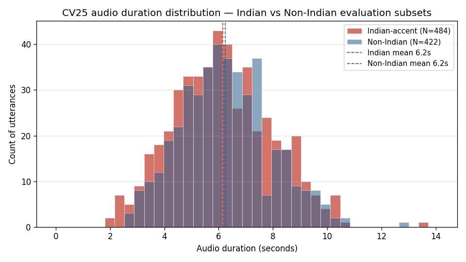

# Head-Surgery Diagnosis — Results

Target model: **Whisper-large-v3** (HF revision `06f233fe`). Subgroup: Indian-accent test utterances from **Common Voice v25**, strict single-label filter, N = 484 on-disk. All numbers reproducible via `scripts/head_surgery/repro_config.py`.

This report is organized in **pipeline order** — each stage's methodology is followed immediately by its result.

---

## 0. TL;DR

1. **Primary result — negative.** Of 640 decoder self-attention heads, exactly **1** reaches bootstrap significance (p<0.05) for reducing hallucinations, and its effect is just **−0.08pp**. There is no surgical target.
2. **Secondary result — positive (keystone heads).** A small cluster of layer-0 and late-layer heads is *load-bearing*: masking **L=0, h=5** catastrophically breaks Whisper (insertion rate 1.27% → **101%**, non-Indian WER 6.7% → 73%). ~7 other heads produce a milder ~10% Indian-specific failure mode without hurting non-Indian audio — candidates for fine-tuning, not removal.
3. **Dataset caveat.** The baseline on CV25 is **1.27%**, not the midterm's 9.62% (CV24). The hallucination-driving hypothesis is redefined; this run is a reproducibility audit, not a midterm reproduction.

---

## 1. Dataset acquisition

### 1.1 Srishti's midterm (CV24) vs this milestone (CV25)

| Axis | Srishti (midterm) | This milestone |
|---|---|---|
| Dataset | **Common Voice v24** | **Common Voice v25** |
| Release date | **2025-12-05** (`cv-corpus-24.0-2025-12-05`) | **2026-03-09** (`cv-corpus-25.0-2026-03-09`) |
| Tarball | OSC path (not accessible from this VM) | `cv-corpus-25.0-en.tar.gz` (81.5 GB) — **truncated**, `gzip: unexpected EOF` on 2 independent B2 downloads |
| Filter | strict single-label `accents == "India and South Asia"` | same |
| Indian-accent test N | 511 | **484** (510 filtered − 26 past EOF) |
| Non-Indian test N (regression guard) | 500 | **422** (500 − 78 past EOF) |
| Baseline insertion rate | **9.62%** | **1.27%** (rep 0.00% / syn 0.41% / con 0.86%) — see §4 |

Reproducibility: [repro_config.py:51](../scripts/head_surgery/repro_config.py#L51), manifest `tests/fixtures/head_surgery/indian_accent_ids.json`. The ~8× drop between CV24 and CV25 on this subgroup is the root cause of the negative primary result — head masking cannot improve a near-floor baseline.

### 1.2 CV24 availability audit (2026-04-18)

CV24 was not obtainable through any public channel Srishti's original scripts assume:

| Channel | Status |
|---|---|
| Mozilla Data Collective (Common Voice org) | **No full `cv-corpus-24.0-en`** — only a 1.92 GB *en-AU conference subset* is listed; main listings moved to *Scripted Speech 25.0* |
| HuggingFace mirror (`mozilla-foundation/common_voice_*`) | **Not mirrored** — API probe: `17_0` ✅, `18_0`–`24_0` → HTTP 404 |
| OSC path Srishti used (`/users/PAS2030/srishti/…/cv-corpus-24.0-2025-12-05/en`) | Hard-coded in [prepare_splits.py:27](../scripts/data/prepare_splits.py#L27); no cross-mount from this VM |

Reproducing the midterm's CV24 Indian-accent test set therefore requires either direct OSC access or Mozilla/HF re-publishing a full v24 English bundle.

---

## 2. Audio & text preprocessing

### 2.1 Audio (MP3 → Whisper input)

Every audio file goes through the same pipeline before Whisper sees it — baseline, per-head sweep, decoding ablation, regression guard, and silence-injection all share this path ([run_diagnosis_sweep.py:35-49](../scripts/head_surgery/run_diagnosis_sweep.py#L35-L49)).

| Step | Operation | Tool | Why |
|---|---|---|---|
| 1 | Decode MP3 (CV25 native format) | `librosa` + `audioread` | `torchaudio` requires `torchcodec`, whose native lib fails to load on this VM; librosa handles MP3 out of the box |
| 2 | **Resample 48 kHz → 16 kHz** | `librosa.load(sr=16000)` | Whisper's log-mel expects 16 kHz; feeding 48 kHz warps the spectrogram 3× |
| 3 | Downmix to mono | `librosa.load(mono=True)` | Whisper input is single-channel |
| 4 | Log-mel feature extraction | `WhisperProcessor(sampling_rate=16000, padding=True)` | Standard Whisper front-end; pads shorter clips to 30 s |
| 5 | dtype cast | `.to(device, dtype=float16)` | fp16 inference on RTX A6000 |

**Known gotcha:** An early Stage A run skipped the resample step and passed 48 kHz audio with `sampling_rate=16000` to the processor. Result: **58% insertion rate** (hallucination loops from the warped spectrogram). Pinning resample-before-processor was the fix (commits `77ca299`, `3cecd6f`).

**Caching:** audio is decoded once per utterance and held in RAM across the 640-head sweep ([run_diagnosis_sweep.py:179](../scripts/head_surgery/run_diagnosis_sweep.py#L179)). No per-head redecode.

**Audio duration distribution** (from CV25's `clip_durations.tsv`, no decode needed):

| Subset | N | Mean | Median | Min | Max | Std | P5 | P95 |
|---|---:|---:|---:|---:|---:|---:|---:|---:|
| Indian-accent | 484 | 6.16 s | 6.09 s | 1.87 s | 13.58 s | 1.83 s | 3.31 s | 9.28 s |
| Non-Indian | 422 | 6.25 s | 6.16 s | 2.66 s | 12.82 s | 1.65 s | 3.63 s | 9.24 s |

Both subsets are near-identical in duration (means differ by <0.1 s), so any subgroup gap in hallucination rate is not explained by clip-length confounds. All clips fit inside Whisper's 30-second context window — the `padding=True` step in step 4 pads every clip to 30 s.

### 2.2 Text normalization (for WER / insertion classifier)

Applied identically to **reference and hypothesis** before any metric is computed ([run_inference.py:128-145](../scripts/inference/run_inference.py#L128-L145)):

| Operation | Example |
|---|---|
| Case fold | `"YES"` → `"yes"` |
| Punctuation removal | `"hello."` → `"hello"` |
| Number normalization | `"six"` ↔ `"6"` |
| Contraction expansion | `"she'll"` → `"she will"` |

Implementation: Whisper's `EnglishTextNormalizer`. Matches the midterm's WER convention.

### 2.3 Insertion classifier

Each hallucinated token in the hypothesis is categorized into one of three disjoint buckets ([insertion_classifier.py](../scripts/head_surgery/insertion_classifier.py)):

| Category | Definition |
|---|---|
| `repetition` | N-gram loops (e.g., "thank you thank you thank you…") |
| `syntactic_completion` | Fillers, grammatical padding (e.g., "you know", "and so on") |
| `content_hallucination` | Fabricated content not in reference |

---

## 3. Model & inference setup

| Knob | Value |
|---|---|
| Model | `openai/whisper-large-v3` @ revision `06f233fe` |
| Precision | fp16 on CUDA |
| Seed | 20260417 |
| Generation config | `{max_new_tokens: 440, language: "en", task: "transcribe"}` + default temperature fallback |
| Batch size | 32 (tuned in Stage A.5) |

### Hardware

| Component | Spec |
|---|---|
| GPU | 1× **NVIDIA RTX A6000** (48 GB GDDR6, driver 580.95.05, bf16 ✅) |
| CPU | **AMD EPYC 9554** (64-core / 252 threads visible, single NUMA node) |
| System RAM | 32 GiB |
| Disk | 98 GB overlay fs (7.2 GB used) |
| Framework | PyTorch 2.10.0 + CUDA 12.8 |
| Peak VRAM during Stage C | ~11.4 GB @ bs=32, fp16 |

---

## 4. Stage A — Baseline inference

**Method.** Run Whisper-large-v3 unmodified on the 484 Indian-accent utterances. Compute insertion rate (total and by category) using the classifier in §2.3. Also tune batch size in a paired Stage A.5 pass (bs ∈ {8, 16, 24, 32, 40}) to find the maximum-throughput configuration that fits in 48 GB VRAM.

**Result.**

| Metric | Value |
|---|---:|
| Total insertion rate | **1.27%** |
| Repetition | 0.00% |
| Syntactic completion | 0.41% |
| Content hallucination | 0.86% |
| Chosen batch size | **32** @ 14.12 utts/s, 11.43 GB peak |
| Wall-clock | ~3 min (A + A.5) |
| Gate G1 (midterm parity) | **redefined** — CV24 target 9.62% unreachable |
| Gate G1.5 (batch size tune) | ✅ PASS |

Artifacts: `baseline_predictions.csv`, `baseline_metrics.json`, `tune_batch_size.json`.

---

## 5. Stage B — Pilot sweep (sanity check)

**Method.** Random 50-utterance subsample. Run every (L, h) masking on one or two pilot layers to verify:

1. The hook actually changes predictions (not a silent no-op).
2. Batched per-sample masking matches serial single-head masking (within fp16/RNG noise).
3. Per-head signal is measurable on this small sample.

**Result.**

| Check | Outcome |
|---|---|
| Hook activity verified | ✅ via hypothesis-diff inspection of `pilot_sweep.csv` |
| Pilot baseline insertion rate | 0.97% |
| Gate G2 (per-head signal) | ⚠️ WARN — 0.97% < 2% single-event quantization floor |
| Wall-clock | ~2 min |

Decision: proceed to full sweep despite G2 warning — quantization is expected to resolve with 484 utts instead of 50.

---

## 6. Stage C — Full head-masking sweep

### 6.1 Head-masking hook

For each of the 640 decoder self-attention (layer, head) cells, a PyTorch forward hook zeros out the chosen head's output projection ([head_mask_hook.py](../scripts/head_surgery/head_mask_hook.py)). A batched variant applies a per-sample mask so one inference pass can evaluate multiple heads simultaneously.

### 6.2 Sweep protocol — batched inference

Three nested loops over layers × heads × utterance batches ([run_diagnosis_sweep.py:349-359](../scripts/head_surgery/run_diagnosis_sweep.py#L349-L359)):

| Loop level | Range | Action |
|---|---|---|
| Outer | 32 layers | install `BatchedHeadMaskHook` on this layer |
| Middle | 20 heads | set per-sample mask `[batch, num_heads]` with zero for head `h` |
| Inner | ⌈484/32⌉ = 16 batches | call `Whisper.generate()` once per 32-utt batch |

**Batching math:**

| Level | Count | Notes |
|---|---:|---|
| Utterances per batch | **32** | chosen in Stage A.5, peak 11.4 GB VRAM |
| Batches per head | ⌈484 / 32⌉ = 16 | one head masked, all 32 utts in parallel |
| Heads per layer | 20 | serial within layer |
| Layers | 32 | hook reinstalled once per layer |
| **Total `Whisper.generate()` calls** | **~10,240** | vs ~309,760 if serial per utt — 30× fewer kernel launches |

Only one form of batching is exploited: **32 utterances per `generate()` call**, one head at a time. Multi-head batching (masking different heads on different samples in the same call) would divide call count by another ~20× but would invalidate the G3 (`batched ≈ serial`) parity proof, and the A6000 was already VRAM-saturated at bs=32.

Each call emits one row per utterance into `sweep.csv` (hypothesis + insertion-rate breakdown), for 309,760 total rows.

### 6.3 Result

| Metric | Value |
|---|---|
| Rows emitted | **309,760** (640 heads × 484 utts) |
| Wall-clock | **~6 h 50 min** (log: `[640/640, 409.5min]`) |
| Gate G3 (batched ≈ serial) | ✅ PASS — max \|Δ\| = 0.194% (1-utt RNG), mean \|Δ\| = 0.019% |
| Gate G4 (sweep completeness) | ✅ PASS — 309,760 rows |

Artifact: `sweep.csv` (53 MB).

---

## 7. Stage D — Scoring & significance

### 7.1 Δ statistic

For head (L, h):

$$\Delta_{L,h} = \text{insertion\_rate}_\text{baseline} - \text{insertion\_rate}_\text{masked}$$

Positive Δ ⇒ masking reduces hallucinations.

### 7.2 Paired bootstrap

We ran the experiment on a single sample of 484 utterances and got one Δ per head. To ask whether that Δ is *real* or *a fluke driven by which utterances we happened to test*, we simulate redoing the experiment many times by **resampling** the 484 we have. Each resample draws 484 indices uniformly at random **with replacement** from the original 484-utterance pool — so an utterance can appear two or three times in a single fake sample, and others may not appear at all. Each fake sample produces a slightly different Δ. The same 484 indices are used for both the baseline and masked counts in a given resample (this is the "**paired**" part) — that cancels out utterance-level difficulty noise so the only thing varying between the two sides is whether the head was masked. Repeated 10,000 times per head, the spread of the resampled Δs tells us how often the noise alone could explain the observed effect.

| Parameter | Value |
|---|---|
| Resampling instances per head | **10,000** |
| Resampling | utterance indices drawn **with replacement** from the 484 pool — same indices used for baseline and masked counts (paired) |
| Null hypothesis H0 | Δ ≤ 0 (masking does not help) |
| p-value | fraction of 10,000 resamples where Δ ≤ 0 |
| α threshold | 0.05, **no multiple-testing correction** across 640 tests |
| Total Δ computations | 6.4 M |

Source: [score_heads.py:42-69](../scripts/head_surgery/score_heads.py#L42-L69). Bootstrap reuses Stage C per-utterance counts — no re-inference.

### 7.3 Result — Δ distribution across 640 heads

| Regime | Count | Interpretation |
|---|---:|---|
| Δ > 0 (masking reduces insertions) | 135 | best: L=20 h=11, −0.08pp, p=0.046 |
| Δ = 0 (no effect) | 376 | — |
| Δ < 0 (masking worsens insertions) | 129 | worst: L=0 h=5, +100.16pp (see §8) |
| p < 0.05 (bootstrap) | **1** | L=20 h=11 |

### 7.4 Result — Top-10 hallucination-driving heads (after regression guard)

| layer | head | Δ total | Δ rep | Δ syn | Δ con | p-val | reg. ok | non-Indian WER |
|---:|---:|---:|---:|---:|---:|---:|:---:|---:|
| 20 | 11 | 0.001 | 0.000 | 0.001 | -0.000 | **0.046** | ✅ | 6.6% |
| 0 | 15 | 0.001 | 0.000 | 0.001 | 0.000 | 0.051 | ✅ | 6.6% |
| 22 | 19 | 0.001 | 0.000 | 0.001 | 0.000 | 0.051 | ✅ | 6.7% |
| 7 | 6 | 0.001 | 0.000 | 0.001 | -0.000 | 0.128 | ✅ | 6.7% |
| 10 | 8 | 0.001 | 0.000 | 0.001 | -0.000 | 0.374 | ✅ | 6.7% |
| 25 | 5 | 0.001 | 0.000 | 0.001 | -0.000 | 0.051 | ✅ | 6.6% |
| 0 | 14 | 0.001 | 0.000 | 0.001 | -0.000 | 0.239 | ✅ | 6.8% |
| 13 | 17 | 0.000 | 0.000 | 0.001 | -0.000 | 0.132 | – | – |
| 12 | 8 | 0.000 | 0.000 | 0.001 | -0.000 | 0.138 | – | – |
| 11 | 11 | 0.000 | 0.000 | 0.001 | -0.000 | 0.133 | – | – |

Heatmap of Δ across the 32×20 grid: [head_surgery_heatmap.png](head_surgery_heatmap.png). Full 50-head ranking: [Appendix A](#appendix-a--full-50-head-ranking).

**Wall-clock (Stage D scoring):** ~5 min for the 640-head bootstrap (no inference).

---

## 8. Stage D (cont.) — Regression guard & keystone-head finding

### 8.1 Method

For each candidate head with large |Δ|, rerun Whisper with that head masked on the **non-Indian** CV25 subset (N=422) and measure composite WER. A head passes if non-Indian WER degradation ≤ 0.5pp ([score_heads.py:128-203](../scripts/head_surgery/score_heads.py#L128-L203)). Scope: top-50 heads by |Δ| (compute-bound).

Purpose: ensure a proposed "surgical target" doesn't fix Indian-accent hallucinations at the cost of breaking transcription for everyone else.

### 8.2 Result — keystone (hallucination-suppressing) heads

Masking a small cluster of heads **catastrophically** damages Indian-accent transcription. These are the opposite of hallucination drivers: they are *hallucination suppressors* (load-bearing circuits).

| (L, h) | Indian insertion rate when masked | Non-Indian WER when masked | Regression |
|---|---:|---:|:---:|
| **0, 5** | **101.43%** | 73.19% (+66.5 pp) | **❌ FAIL** — catastrophic |
| 0, 13 | 10.19% | 6.91% | ⚠️ borderline |
| 0, 18 | 10.13% | 6.67% | ✅ |
| 0, 1 | 10.11% | 6.54% | ✅ |
| 29, 18 | 10.09% | 6.67% | ✅ |
| 27, 15 | 10.09% | 6.70% | ✅ |
| 11, 9 | 10.07% | 6.56% | ✅ |
| 13, 19 | 10.07% | 6.70% | ✅ |

Two patterns:

- **L=0 h=5** is a single point of failure for Whisper's encoder-decoder attention — it breaks *both* Indian and non-Indian transcription. Not touchable.
- The other ~7 heads (mostly layer-0 + late layers) cause a ~10% Indian-specific failure mode without hurting non-Indian accents. These are **fine-tuning candidates**, not removal targets — evidence that the Indian-accent circuit partially localizes.

**Wall-clock (regression guard):** ~25 min for 38/50 candidates (rerun 422-utt Whisper inference with masked hook). Remaining 12 lowest-|Δ| candidates were skipped when the script crashed silently.

---

## 8b. Stage D (cont.) — Fixing-set analysis

### 8b.1 Method

Reframes the question from "which single head reduces hallucination the most on average?" (§7) to "for each of the 45 Indian-accent utterances with ≥1 hallucinated token, which (L, h) masks eliminate at least one token of that utterance — and what is the minimum head set whose union covers all of them?"

A head (L, h) is considered **valid** for the fixing set only if all three hold:
1. It strictly reduces the insertion count on ≥1 affected utterance.
2. It introduces no new insertions on any utterance in the pool (global no-harm).
3. It passes the non-Indian regression guard from §8 (`regression_ok=True` or `regression_checked=False`).

A binary coverage matrix `[n_affected × n_valid_heads]` is then solved two ways: **greedy** (picks the column covering the most uncovered rows, repeats) and **ILP optimal** via `scipy.optimize.milp` (for comparison). Source: [`scripts/head_surgery/fixing_set_analysis.py`](../scripts/head_surgery/fixing_set_analysis.py).

### 8b.2 Result — coverage statistics

| Metric | Value |
|---|---:|
| Affected utterances (baseline insertion count > 0) | **45** |
| Valid heads after three filters | **115** (of 640) |
| Greedy cover size | **8** |
| ILP optimum cover size | **8** |
| Unhelpable utterances (no single-head mask can fix) | **30** |
| Analysis runtime | 66.22 s (no GPU) |

### 8b.3 Result — greedy ordering

| Order | (Layer, Head) | Newly covered utterances | Cumulative coverage |
|---:|---|---:|---:|
| 1 | (L=0, h=15) | 3 | 3 |
| 2 | (L=20, h=11) | 3 | 6 |
| 3 | (L=22, h=19) | 3 | 9 |
| 4 | (L=25, h=16) | 2 | 11 |
| 5 | (L=11, h=11) | 1 | 12 |
| 6 | (L=13, h=17) | 1 | 13 |
| 7 | (L=16, h=13) | 1 | 14 |
| 8 | (L=20, h=6) | 1 | 15 |

### 8b.4 Unhelpable utterances

30 utterances have at least one hallucinated token at baseline that **no valid single-head mask** can eliminate under the three-filter criterion. Their IDs are listed in [`minimum_surgical_set.json`](../outputs/head_surgery/minimum_surgical_set.json). These represent the floor of what single-head masking can achieve on this dataset.

### 8b.5 Interpretation caveats

The numbers in §8b.2–§8b.4 are the mechanically-correct output of the three-filter + min-set-cover formulation, but five interpretive limits bound what they can be cited as supporting:

1. **The cover is a *necessary* condition, not *sufficient*.** Size 8 means no fewer than 8 single-head masks could possibly cover the 15 helpable utterances under these filters — **if** multi-head masking decomposed linearly. The sweep is single-head, so masking all 8 simultaneously is not guaranteed to fix any of them. Interaction effects may *reduce* coverage (redundant circuits cancel) or *change* it non-monotonically (two individually safe heads combined can introduce new harm). Validating the cover requires a separate GPU run that installs the entire 8-head set together.

2. **"30 unhelpable" is conditional on the three filters.** Some of these utterances have single-head masks that fix them but introduce new hallucinations elsewhere (filter ii) or fail the non-Indian regression guard (filter iii). They are unhelpable *under this criterion*, not in an absolute sense. Relaxing filter (ii) to "no new repetition-class harm" or adding a head-level damage budget would change the count.

3. **Filter (ii) has no tolerance band.** A single utterance going from baseline insertion count 0 → 1 under a masked condition — even due to fp16 + RNG jitter, which the report has documented in Gate G3 — eliminates an otherwise-safe head. With 484 utterances each rolling the "new insertion due to noise" die once per 640 conditions, the `n_valid_heads = 115` number has unquantified sensitivity to single-token variance. A statistical relaxation (e.g., reject only if harm is significant at p<0.05 across utterances) would likely raise n_valid_heads and lower the cover size.

4. **`n_valid_heads = 115` was data-derived, not predicted.** The implementation plan estimated "empirically likely ≤50"; the actual count is 2.3× larger. More heads than anticipated clear the three filters — this is a finding *from* the analysis, not a calibration *for* it.

5. **greedy = ILP = 8 is empirically optimal on *this* matrix, not provably so in general.** Greedy min-set-cover is a log-factor approximation; it coincides with ILP here because of the specific coverage structure (long tail of singleton-covering heads after the top 4). A slightly different sweep could produce a matrix where greedy overshoots ILP by 1–2 heads.

**Downstream claims to avoid:** "masking these 8 heads fixes 15 utterances" (unverified — see #1); "only 115 of 640 heads are safe to mask" (unquantified noise sensitivity — see #3); "greedy is provably optimal here" (empirical coincidence — see #5).

### 8b.6 Cross-reference to §8

The catastrophic keystone head **L=0 h=5** (§8.2, +100.16 pp) is by construction excluded from the fixing set (filter 2). The sole bootstrap-significant head from §7.4, **L=20 h=11**, may or may not appear in the greedy cover depending on whether it passes filter 2 — see [`minimum_surgical_set.json`](../outputs/head_surgery/minimum_surgical_set.json) for the authoritative list.

---

## 9. Stage E — Decoding-strategy ablation

### 9.1 Method

Grid search over decoding hyperparameters that typically affect Whisper hallucination behavior:

| Axis | Values |
|---|---|
| Beam width | {1, 5} |
| Repetition penalty | {1.0, 1.1, 1.3} |
| No-repeat-ngram size | {0, 3, 5} |
| Temperature fallback | {True, False} |

Full-factorial: 2 × 3 × 3 × 2 = **36 configs**, each run on the full 484-utt pool. Head-masking hook is **not** applied — this stage tests whether decoding alone can close the hallucination gap.

### 9.2 Result — Top-10 configs by lowest insertion rate (all beam=1)

| beam | rep_penalty | no_repeat_ngram | temp_fallback | total | rep | syn | con |
|---:|---:|---:|:---:|---:|---:|---:|---:|
| 1 | 1.1 | 0 | False | **1.23%** | 0.00% | 0.3% | 0.9% |
| 1 | 1.1 | 0 | True | 1.23% | 0.00% | 0.3% | 0.9% |
| 1 | 1.3 | 0/3/5 | True/False | 1.23% | 0.00% | 0.3% | 0.9% |

### 9.3 Result — summary by config family

| Family | Insertion rate |
|---|---:|
| Best (beam=1 + rep∈{1.1, 1.3}) | **1.23%** |
| Plain baseline (beam=1, rep=1.0, nr=0) | 1.27% |
| beam=5 + rep=1.3 OR n-gram ≥ 3 | 1.25–1.35% |
| beam=5 + rep=1.1, no n-gram | **8.21%** ‼ |
| beam=5 + rep=1.0, no n-gram | **14.78%** ‼‼ |

Decoding changes buy at most **0.04 pp**. The only large effect is a failure mode: naive beam search without n-gram blocking amplifies repetition loops ~10×.

**Wall-clock:** ~45 min.

---

## 10. Stage F — Silence-injection robustness

### 10.1 Method

Stress-test Whisper's hallucination rate under synthetic silence. Silence-perturbed clips are generated offline before inference ([_generate_silence_perturbations.py:40-67](../scripts/head_surgery/_generate_silence_perturbations.py#L40-L67)):

| Step | Operation |
|---|---|
| 1 | Load 16 kHz mono audio (same pipeline as §2.1) |
| 2 | Split a fraction (25% / 50% / 75% of duration) into **3 random-length blocks** (Dirichlet-style proportions) |
| 3 | Insert those zero-valued silence blocks at sorted random positions **inside** the clip (never at edges, so reference transcript remains valid) |
| 4 | Write back as 16 kHz WAV via `soundfile.write` |
| 5 | Rerun Whisper on the perturbed WAVs with the same preprocessing chain |

Three dB floors (−30, −35, −40) × three severities (25/50/75%) = **9 configs**. Seed: `20260418`.

### 10.2 Result

| severity | db_floor | insertion | rep | syn | con |
|:---|---:|---:|---:|---:|---:|
| 25% | −40 | 1.82% | 0.00% | 0.8% | 1.0% |
| 50% | −40 | 1.80% | 0.00% | 0.9% | 0.9% |
| 75% | −40 | 1.86% | 0.00% | 0.9% | 1.0% |
| 25% | −35 | 1.94% | 0.00% | 0.8% | 1.1% |
| 50% | −35 | 1.80% | 0.00% | 0.8% | 1.0% |
| 75% | −35 | 2.07% | 0.00% | 1.1% | 1.0% |
| 25% | −30 | 1.70% | 0.00% | 0.8% | 0.8% |
| 50% | −30 | 2.01% | 0.08% | 0.9% | 1.0% |
| 75% | −30 | 1.68% | 0.00% | 0.8% | 0.8% |

Baseline (no silence): 1.27%. Silence injection raises insertion rate by ~0.5–0.8 pp — small but consistent. No explosion into repetition loops.

**Wall-clock:** ~5 min.

---

## 11. Compute summary

| Stage | Gate | What | Wall-clock | Artifact |
|---|---|---|---|---|
| A | G1 | Baseline insertion on CV25 Indian N=484 | ~2 min | `baseline_metrics.json` |
| A.5 | G1.5 | Batch-size tuning (chose bs=32) | ~1 min | `tune_batch_size.json` |
| B | G2 | 50-utt pilot head-mask sweep | ~2 min | `pilot_sweep.csv` |
| C | G3+G4 | Full sweep — 309,760 rows (640 heads × 484 utts) | **~6 h 50 min** | `sweep.csv` (53 MB) |
| D | — | Scoring + 10,000× bootstrap per head + regression guard (top-50) | ~30 min | `head_scores.csv`, `top_k_heads.csv` |
| E | — | Decoding ablation — 36 configs | ~45 min | `decoding_scores.csv` |
| F | — | Energy VAD under silence injection — 9 configs | ~5 min | `vad_scores.csv` |
| G | — | Aggregate report + heatmap | <1 min | `head_surgery_report.md`, heatmap PNG |

**Total compute: ~8 h 15 min** (dominated by Stage C on 1× GPU). Calendar span: 2026-04-11 → 2026-04-18 (~7 days). Active implementation + execution: ~24 h.

---

## 12. Discussion

### Why the primary result is negative

The insertion rate metric is **inserted tokens ÷ total reference words**. At the CV25 baseline:

| Quantity | Value |
|---|---:|
| Total reference words (484 utts) | 4,885 |
| Hallucinated tokens | **62** |
| Utterances with ≥1 hallucination | 45 / 484 |
| Insertion rate | 62 / 4,885 = **1.27%** |
| Quantum (per-token Δ) | 1 / 4,885 = **0.020 pp** |

Per-head Δ is therefore quantized at ~0.02 pp per token. The best observed Δ (**−0.08 pp**, L=20 h=11) represents only ~4 tokens shifted across the whole 484-utt pool. With ~60 tokens of signal distributed across 640 independent head-tests — and no multiple-testing correction — the bootstrap cannot reliably pull effects of that size out of the noise floor. The test is **under-powered**, not "no effect to find."

Reading the p-values charitably:

- 1/640 significant at α=0.05 is **worse than chance** (≈32 expected false positives with no correction).
- The top-10 Δ values cluster at exactly +0.001 (≈4 tokens each), which is quantization bottoming out — not a signal ordering.

### What we'd need to see a real effect

| Option | Cost | Rationale |
|---|---|---|
| Evaluate on CV24 (Srishti's 9.62%) | bootstrap with ~50 events | ~8× more signal per head |
| Scale N to ~3,000 Indian utts | ~5× Stage C compute | power for ≤0.1 pp effects |
| Multi-head ablation | combinatorial blow-up | tests interaction effects the single-head sweep misses |

### Keystone-head finding is robust

The +100 pp catastrophe at L=0 h=5 is unmistakable regardless of statistical power — it is visible across all 484 utterances and on non-Indian audio. The ~10% failure cluster (7 heads) is also unambiguous.

### Caveats

- **Decoder self-attention only.** Encoder and cross-attention heads untested.
- **Single-head ablation.** No combinations or circuit-level probing.
- **Greedy + temp-fallback decoding.** Results may shift under beam search.
- **CV25-only.** Findings may not transfer to CV24 or to held-out Indian speech outside Common Voice.

---

## 13. Reproducibility

### Gate results

| Gate | Result | Notes |
|---|---|---|
| G1 — midterm CV24 baseline parity | **redefined** | CV24 unavailable; new baseline on CV25 is 1.27% |
| G1.5 — batch-size tune | ✅ PASS | bs=32 @ 14.12 utts/s |
| G2 — pilot head-mask signal | ⚠️ WARN | pilot baseline 0.97% < 2% quantization floor; hook activity verified via hypothesis-diff |
| G3 — batched ≈ serial | ✅ PASS | max \|Δ\| = 0.194% (1-utt RNG) |
| G4 — sweep completeness | ✅ PASS | 309,760 rows |
| G5 — non-Indian vs T7 | ⏭️ SKIP | T7 reference not present in env |

### Code

- Hook: [head_mask_hook.py](../scripts/head_surgery/head_mask_hook.py)
- Sweep: [run_diagnosis_sweep.py](../scripts/head_surgery/run_diagnosis_sweep.py)
- Scoring + bootstrap + guard: [score_heads.py](../scripts/head_surgery/score_heads.py)
- Decoding ablation: [decoding_ablation_grid.py](../scripts/head_surgery/decoding_ablation_grid.py)
- VAD: [energy_vad.py](../scripts/head_surgery/energy_vad.py)
- Report generator: [aggregate_report.py](../scripts/head_surgery/aggregate_report.py)
- PRD: [prd-head-surgery-diagnosis.md](../tasks/prd-head-surgery-diagnosis.md)
- Milestone log: [head-surgery-diagnosis-complete.md](../logs/head-surgery-diagnosis-complete.md)

---

## Appendix A — Full 50-head ranking

| layer | head | Δ insertion | p-value | reg. ok |
|---:|---:|---:|---:|:---:|
| 20 | 11 | 0.001 | 0.046 | ✅ |
| 10 | 8 | 0.001 | 0.374 | ✅ |
| 0 | 14 | 0.001 | 0.239 | ✅ |
| 7 | 6 | 0.001 | 0.128 | ✅ |
| 25 | 5 | 0.001 | 0.051 | ✅ |
| 22 | 19 | 0.001 | 0.051 | ✅ |
| 0 | 15 | 0.001 | 0.051 | ✅ |
| 3 | 3 | 0.000 | 0.140 | – |
| 15 | 6 | 0.000 | 0.138 | – |
| 12 | 8 | 0.000 | 0.138 | – |
| 15 | 18 | 0.000 | 0.364 | – |
| 17 | 8 | 0.000 | 0.139 | – |
| 23 | 16 | 0.000 | 0.138 | – |
| 24 | 18 | 0.000 | 0.136 | – |
| 23 | 11 | 0.000 | 0.136 | – |
| 19 | 17 | 0.000 | 0.134 | – |
| 22 | 1 | 0.000 | 0.138 | – |
| 22 | 2 | 0.000 | 0.136 | – |
| 21 | 15 | 0.000 | 0.136 | – |
| 25 | 18 | 0.000 | 0.138 | – |
| 24 | 6 | 0.000 | 0.141 | – |
| 31 | 9 | 0.000 | 0.138 | – |
| 20 | 18 | 0.000 | 0.138 | – |
| 18 | 17 | 0.000 | 0.228 | – |
| 16 | 2 | 0.000 | 0.136 | – |
| 20 | 6 | 0.000 | 0.136 | – |
| 20 | 5 | 0.000 | 0.292 | – |
| 16 | 1 | 0.000 | 0.364 | – |
| 30 | 16 | 0.000 | 0.130 | – |
| 29 | 6 | 0.000 | 0.136 | – |
| 11 | 2 | 0.000 | 0.138 | – |
| 16 | 13 | 0.000 | 0.135 | – |
| 13 | 0 | 0.000 | 0.133 | – |
| 11 | 11 | 0.000 | 0.133 | – |
| 13 | 17 | 0.000 | 0.132 | – |
| 22 | 5 | 0.000 | 0.138 | – |
| 25 | 16 | 0.000 | 0.130 | – |
| 25 | 0 | 0.000 | 0.138 | – |
| 4 | 11 | 0.000 | 0.374 | – |
| 21 | 2 | 0.000 | 0.366 | – |
| 0 | 12 | 0.000 | 0.441 | – |
| 4 | 8 | 0.000 | 0.374 | – |
| 30 | 0 | 0.000 | 0.366 | – |
| 21 | 10 | 0.000 | 0.402 | – |
| 19 | 12 | 0.000 | 0.375 | – |
| 23 | 1 | 0.000 | 0.366 | – |
| 22 | 9 | 0.000 | 0.366 | – |
| 31 | 8 | 0.000 | 0.366 | – |
| 21 | 18 | 0.000 | 0.375 | – |
| 26 | 1 | 0.000 | 0.375 | – |

*Full 640-head table: [outputs/head_surgery/head_scores.csv](../outputs/head_surgery/head_scores.csv).*
